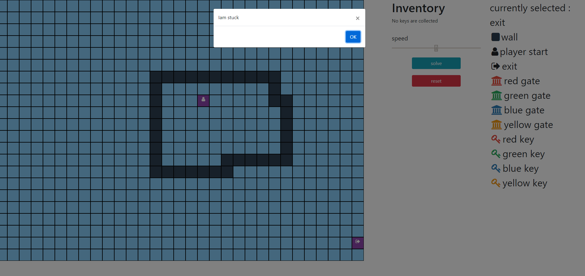

# dungeon escaping visualizer
dungeon escaping visualizer is a maze solver based on path finding algorithm in an attemp to find the exit from a dungeon that has different king of gates and keys.

the link to visualizer  https://dungeon-escaping-visualizer.netlify.app/   
the visualizer is based on the SPOJ problem here https://www.spoj.com/problems/CERC07K/

you can initialize the state of the dungeon by select what item to place in the grid and when you are happ with what you achieved just click SOLVE and see the shortest path to the exit OR if your player is stuck 

 

while you are solving the maze you will see how your inventory change during the path and you can also control the speed of the visualization
 

## have fun visualizing and feel free to check the code if you like 

